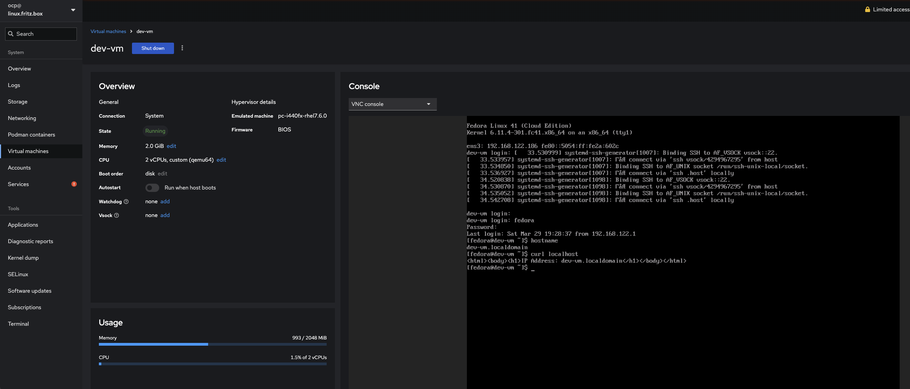

= Terraform Libvirt KVM VM Deployment
:author: shrishs
:revdate: {docdate}
:icons: font

This project provisions a RHEL/Fedora-based virtual machine using Terraform, Libvirt/KVM, and cloud-init. SSH keys, hostname, password injection, and HTTP setup are handled via cloud-init.

== 📁 Directory Structure

[source,plaintext]
.
├── environments
│   └── dev
│       ├── id_rsa
│       ├── id_rsa.pub
│       ├── main.tf
│       ├── providers.tf
│       ├── terraform.tfvars
│       └── variables.tf
└── modules
    └── vm
        ├── cloud-init.yaml
        ├── main.tf
        ├── outputs.tf
        ├── providers.tf
        └── variables.tf

== 🚀 Getting Started

=== 1. Initialize Terraform

[source,bash]
----
cd environments/dev/
terraform init
----

Sample output:
[subs="quotes"]
----
Initializing the backend...
Initializing modules...
- rhel_vm in ../../modules/vm
Installing providers...
Terraform has been successfully initialized!
----

=== 2. Plan the deployment

[source,bash]
----
terraform plan -out=tfplan
----

=== 3. Apply the plan

[source,bash]
----
terraform apply tfplan
----

Sample output:
----
Apply complete! Resources: 5 added, 0 changed, 0 destroyed.
Outputs:
vm_name = "dev-vm"
----

== ✅ Verifying the VM

=== Check created volumes

[source,bash]
----
sudo virsh vol-list default
----

Output:
----
Name                     Path
---------------------------------------------------------------
dev-vm-cloudinit.iso     /var/lib/libvirt/images/dev-vm-cloudinit.iso
dev-vm.qcow2             /var/lib/libvirt/images/dev-vm.qcow2
----

=== Get VM IP address

[source,bash]
----
sudo virsh domifaddr dev-vm
----

Sample output:
----
Name     MAC address        Protocol   Address
----------------------------------------------------------
vnet30   52:54:00:ae:07:39  ipv4       192.168.122.226/24
----

=== SSH into the VM

[source,bash]
----
ssh -i id_rsa fedora@192.168.122.226
----

Accept the fingerprint prompt on first login.

=== Validate from inside the VM

[source,bash]
----
[fedora@dev-vm ~]$ hostname -f
dev-vm.localdomain

[fedora@dev-vm ~]$ curl localhost
<html><body><h1>IP Address: dev-vm.localdomain</h1></body></html>
----

=== All the above steps can also be verified from Cockpit.

=== Clean up all the resources.

[source,bash]
----
[ocp@linux dev]$ terraform destroy
----

== 🔧 What It Does

- Creates a KVM virtual machine using libvirt provider
- Injects SSH key and sets password via cloud-init
- Installs Apache HTTP server and serves a simple HTML page with hostname
- Sets custom hostname (e.g., `dev-vm.localdomain`)

== 📝 Notes

- Ensure the `id_rsa.pub` used is valid and readable
- The password is set using a SHA-512 hash via `openssl passwd -6`
- `cloud-init.yaml` is templated via Terraform’s `template_file`

== 🔐 .gitignore Recommendation

[source]
----
.terraform/
*.tfstate
*.tfstate.*
*.tfvars
*.tfplan
*.lock.hcl
*.pem
*.key
id_rsa*
.password_hash
----

== 📦 Providers Used

- `dmacvicar/libvirt` (v0.7.1)
- `hashicorp/random`
- `hashicorp/null`
- `hashicorp/template`
- `hashicorp/local`

== 🧰 Tools Required

- Terraform >= 1.3
- KVM / libvirt installed
- SSH key pair (`id_rsa` + `id_rsa.pub`)
- A cloud-init compatible image (e.g., Fedora Cloud Base)

== 🙌 Result

After deployment, you get a cloud-init bootstrapped VM with:
- SSH key login
- Hostname set
- Apache installed and running
- Simple landing page with the VM's hostname

Happy provisioning! 🚀

